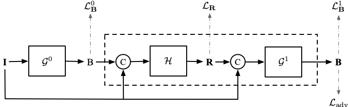
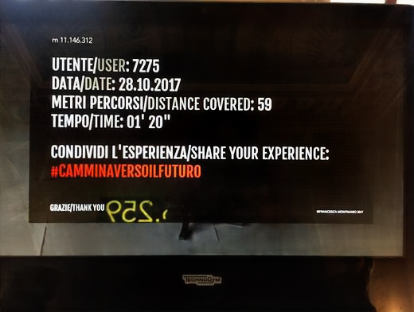
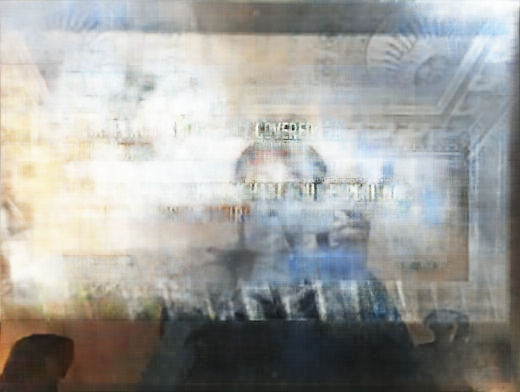
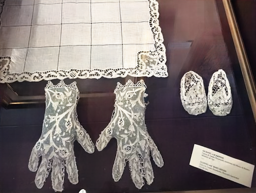
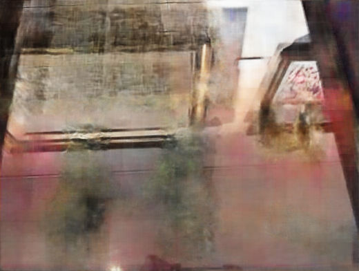

# bdn-refremv
Deep Bidirectional Estimation for Single Image Reflection Removal. This package is the implementation of the paper:

<small>*Seeing Deeply and Bidirectionally: A Deep Learning Approach for Single Image Reflection Removal  
Jie Yang\*, Dong Gong\*, Lingqiao Liu, Qinfeng Shi.  
In European Conference on Computer Vision (ECCV), 2018.*  (* Equal contribution)
\[[Paper](https://donggong1.github.io/docs/refmov_eccv18.pdf)\]
</small>



## Examples

From left to right: I, B, R



\





Please refer the paper for technique details.

## Requirements

+ Python packages
    ```
    pytorch>=0.4.0
    numpy
    pillow
    ```
+ An NVIDIA GPU and CUDA 9.0 or higher

## Usage

+ Download our pretrained model [here](https://drive.google.com/open?id=1zBCl2qI_fT3CwPZkVvZEv37bDIlhakF6). Unpack the archive into `model` folder.

+ Put test images into `samples` folder, and run script `bash test.sh`.

## Synthetic datasets

[Training data](https://drive.google.com/open?id=1bbWsGG1qQgB-sbktI2h5vO8UhD1uHaj7)
[Test data](https://drive.google.com/open?id=1ZeeKJVbZ_bifsdpAlbguDleViDA4QjCw)

## Citation
If you use this code for your research, please cite our paper:
````
@inproceedings{eccv18refrmv,
author = {Yang, Jie and Gong, Dong and Liu, Lingqiao and Shi, Qinfeng},
title = {Seeing Deeply and Bidirectionally: A Deep Learning Approach for Single Image Reflection Removal},
booktitle = {European Conference on Computer Vision (ECCV)},
year = {2018}
}
````
